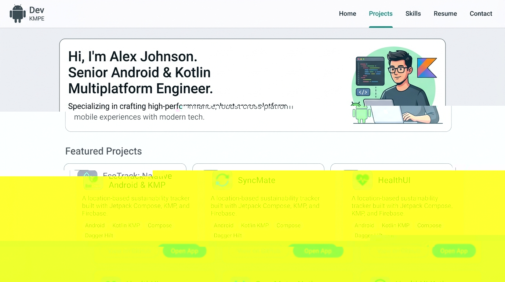

# Redesign Portfolio using Material Design 3 Guidelines

Here is the high-fidelity visual direction of the redesigned Material 3 layout:

This plan outlines the redesign of the developerFolio portfolio using Material Design 3 (M3) guidelines for web. The goal is to provide a clean, modern, and minimal design suitable for a Senior Android/Kotlin Multiplatform (KMP) engineer.

## User Review Required

> [!IMPORTANT]
> **No Purple-Heavy Palette**: The color scheme will use a professional Material 3 Slate-Teal/Blue palette, which matches the Android and Kotlin ecosystem branding without relying on heavy purple colors.
>
> **Lavish Tool Availability**: The "Lavish" preview tool is not available in this environment. As the closest alternative to show the visual direction before writing code, we will generate a high-fidelity visual mockup of the proposed Material 3 layout.
>
> **Disabled Sections Cleanup**: We will clean up unused template components (Achievements, Talks, Twitter embed, Podcasts) from `Main.js` to streamline the layout and speed up page load.

## Open Questions

> [!NOTE]
> None. All requirements are clear. We will proceed once you approve this plan.

## Proposed Changes

### 1. Global Styles & Theme Configuration
* We will update the global styling system to use Material 3 color variables, border-radius tokens, and elevation shadows.
* The palette will be Slate-Teal/Blue (primary: `#00639b` for light, `#94ccff` for dark) and Neutral-Variant backgrounds.

#### [MODIFY] [index.css](file:///Users/shahidiqbal/projects/Portfolio/src/index.css)
* Update `:root` and `.dark-mode` variables to match Material 3 color roles: `primary`, `on-primary`, `primary-container`, `surface`, `surface-variant`, `outline`, `outline-variant`.
* Set Material 3 border-radius tokens (`8px`, `12px`, `16px`, `24px`, `28px`).
* Set Material 3 elevation shadows (subtle borders and tonal overlay colors rather than dark drop shadows).

#### [MODIFY] [_globalColor.scss](file:///Users/shahidiqbal/projects/Portfolio/src/_globalColor.scss)
* Map variables to the new CSS variables (such as `$buttonColor`, `$textColor`, `$lightBackground2`, and hovers) so that existing styles automatically inherit the new Material 3 theme.

---

### 2. Layout Structure & Unused Sections Cleanup
* Streamline the application flow by removing sections that are disabled in `portfolio.js` to ensure clean DOM and fast load times.

#### [MODIFY] [Main.js](file:///Users/shahidiqbal/projects/Portfolio/src/containers/Main.js)
* Remove imports and rendering blocks of unused containers: `Achievement`, `Talks`, `Twitter`, and `Podcast`.

---

### 3. Component Redesigns (Material 3 Style)

#### [MODIFY] [Header.scss](file:///Users/shahidiqbal/projects/Portfolio/src/components/header/Header.scss)
* Redesign the navigation bar with modern typography, subtle borders, and M3 tonal elevation.

#### [MODIFY] [Greeting.scss](file:///Users/shahidiqbal/projects/Portfolio/src/containers/greeting/Greeting.scss)
* Improve alignment, clean up padding, and update button classes to use the M3 design system.

#### [MODIFY] [Button.scss](file:///Users/shahidiqbal/projects/Portfolio/src/components/button/Button.scss)
* Design buttons with M3 pill-shape (`var(--radius-full)`) and proper padding/hover states. Add secondary outlined button support.

#### [MODIFY] [Skills.scss](file:///Users/shahidiqbal/projects/Portfolio/src/containers/skills/Skills.scss) & [SoftwareSkill.scss](file:///Users/shahidiqbal/projects/Portfolio/src/components/softwareSkills/SoftwareSkill.scss)
* Style the skill icons list as clean M3 outlines, with subtle hover states.

#### [MODIFY] [ExperienceCard.scss](file:///Users/shahidiqbal/projects/Portfolio/src/components/experienceCard/ExperienceCard.scss)
* Redesign `ExperienceCard` to follow M3 Elevated Card specifications: clean outline borders, flat or low shadow, soft corner radius, and updated text structure/hierarchy.

#### [MODIFY] [StartupProjects.scss](file:///Users/shahidiqbal/projects/Portfolio/src/containers/StartupProjects/StartupProjects.scss)
* Redesign project cards to look like M3 Outlined/Elevated Cards with proper category chips and tech tags (M3 Filter Chips). Update alignment, margins, and actions buttons.

#### [MODIFY] [GithubRepoCard.scss](file:///Users/shahidiqbal/projects/Portfolio/src/components/githubRepoCard/GithubRepoCard.scss)
* Update github cards to M3 style with modern outline borders, proper font sizes, and layout.

#### [MODIFY] [EducationCard.scss](file:///Users/shahidiqbal/projects/Portfolio/src/components/educationCard/EducationCard.scss)
* Redesign the education card layout to use modern card shapes.

#### [MODIFY] [Contact.scss](file:///Users/shahidiqbal/projects/Portfolio/src/containers/contact/Contact.scss)
* Clean up typography and alignment for a minimal modern look.

---

## Verification Plan

### Automated Tests
* We will verify compiling and building the production bundle locally:
  `npm run build`
* We will run any existing test suite:
  `npm run test`

### Manual Verification
* We will run a dev server:
  `npm run start`
* Inspect responsiveness on mobile, tablet, and desktop views.
